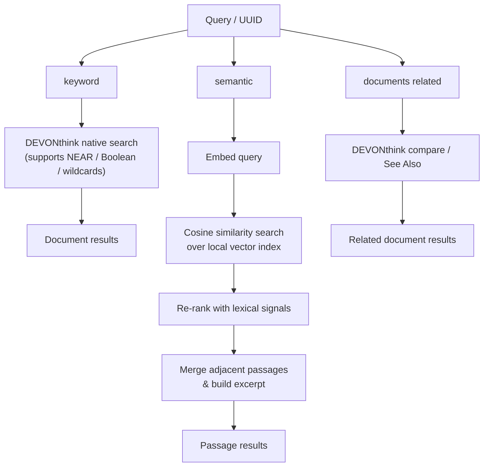

# dtx

[](https://github.com/TomBener/dt-agent-cli/actions/workflows/release.yml)

An agent-friendly CLI for read-only DEVONthink access with optional semantic indexing and citation-key mapping.

## Key Features

- Read-only DEVONthink operations (search/read/browse)
- Keyword retrieval via DEVONthink, semantic retrieval via the local vector index, and related-document lookup
- Citation key mapping via bibliography JSON (`file -> id`)
- Default JSON output for easy AI-agent integration
- Configurable index directory per command (`--index-dir`)

## Requirements

- macOS with DEVONthink 4.2+
- Node.js 20+
- Gemini or OpenAI key for indexing and `dtx semantic`
- `databases/groups/documents` commands and `dtx keyword` do not require embedding API keys

## Install (Homebrew)

```bash
brew install tombener/tap/dtx
```

Then run:

```bash
dtx help
```

## Quick Start

```bash
npm install
npm run build
npm link
```

## Output Contract

- `stdout`: JSON response
- `stderr`: progress logs (for long-running operations like indexing)

Success shape:

```json
{
  "ok": true,
  "data": {},
  "meta": {
    "elapsedMs": 123
  }
}
```

Error shape:

```json
{
  "ok": false,
  "error": {
    "code": "MISSING_ARGUMENT",
    "message": "..."
  },
  "meta": {}
}
```

## Commands

```bash
dtx version
dtx doctor [--index-dir <path>]
dtx keyword --query "<q>" [--database <name>] [--group <uuid>] [--limit <n>] [--with-abstract]
dtx semantic [--query "<q>"] [--database <name>] [--group <uuid>] [--limit <n>] [--per-doc <n>] [--context] [--debug] [--index-dir <path>] [--citation-key <key>] [--uuid <recordUuid>]
dtx databases list
dtx groups list [--uuid <groupUuid>] [--limit <n>]

dtx documents get (--uuid <recordUuid> | --citation-key <key>) [--max-length <n>]
dtx documents related --uuid <recordUuid> [--limit <n>]

dtx index build [--database <name>] [--group <uuid>] [--include-md] [--force] [--bib <path>] [--index-dir <path>] [--content-max-length <n>]
dtx index status [--index-dir <path>]
```

## Retrieval Modes

There are two top-level retrieval commands:

**1. DEVONthink native retrieval** (`dtx keyword`)
Passes the query directly to DEVONthink's search engine and returns document-level results. Supports all DEVONthink search operators: `NEAR`, `AND`, `OR`, `NOT`, wildcards, field qualifiers (`name:`, `tag:`, etc.), and parentheses. Use this for coarse filtering or when you need operator-based queries.

- Results include `path` and, when resolvable from bibliography JSON, `citationKey`, `author`, and `year`
- `dtx keyword` defaults to the configured Zotero group scope unless you pass `--database` or `--group`
- Pass `--with-abstract` when you want abstracts included in results
- `dtx documents get` accepts either a DEVONthink `--uuid` or a bibliographic `--citation-key`
- Bibliographic enrichment is sourced from `bibliography.json`

**2. Local index retrieval** (`dtx semantic`)
Queries the local vector index built by `dtx index build` and returns passage-level results. It embeds the query and performs cosine similarity search, then re-ranks with lexical signals.

- `dtx semantic` defaults to the configured Zotero group scope unless you pass `--database` or `--group`
- It supports `--uuid <recordUuid>` and `--citation-key <key>` to scope retrieval to a known document
- With no query plus `--uuid` / `--citation-key`, it returns the document's indexed passages in order
- `dtx semantic` requires an embedding API key at query time

- `dtx documents related`
  Uses DEVONthink `See Also` / `compare()` and returns related documents for one known UUID.



## Index Directory Configuration

Priority order:

1. `--index-dir <path>`
2. `DT_INDEX_DIR` (env)
3. `~/Library/CloudStorage/Dropbox/bibliography/dtx-index` (default)

Index files:

- `vectors.bin`
- `chunks.json`
- `meta.json`
- `chunks.001.json`, `chunks.002.json`, ... (auto-generated chunk shards)

## Example: Database-Scoped Index with Citation Keys

```bash
dtx index build \
  --database Inbox \
  --bib ~/Library/CloudStorage/Dropbox/bibliography/bibliography.json \
  --index-dir ~/Library/CloudStorage/Dropbox/bibliography/dtx-index
```

Defaults for `dtx index build`:

- Group UUID: `33203673-B7E2-4F3F-9D87-6E83EB4781EA` (or `DT_DEFAULT_GROUP_UUID`)
- Database: omitted by default; passing `--database` disables the default group unless `--group` is also provided
- Bibliography path: `~/Library/CloudStorage/Dropbox/bibliography/bibliography.json` (or `BIBLIOGRAPHY_JSON_PATH` env)
- Markdown files are excluded unless `--include-md` is provided
- `--content-max-length` defaults to no truncation (`0` also means no truncation)
- Semantic chunking defaults to `800` chars with `120` chars of overlap
- Chunk metadata shard size defaults to `10000`

`dtx semantic` requires a local index (`dtx index build`):

- By default, semantic retrieval is limited to group `33203673-B7E2-4F3F-9D87-6E83EB4781EA` (or `DT_DEFAULT_GROUP_UUID`)
- By default, results return only `excerpt`; pass `--context` to also include `contextText`
- By default, at most 2 passages per document are returned; use `--per-doc <n>` to change (0 for no cap)
- Pass `--debug` to include internal ranking and passage-location fields
- Results are post-processed into short excerpts, with adjacent hits merged
- Pass `--uuid <recordUuid>` or `--citation-key <key>` without a query to read that document as consecutive passages
- Pass `--uuid <recordUuid>` or `--citation-key <key>` with a query to search only within that document

## Configuration (Environment Variables)

Set env vars in your shell/profile (or pass inline per command). Important ones:

- `EMBEDDING_PROVIDER`
- `EMBEDDING_MODEL`
- `GOOGLE_API_KEY` (when `EMBEDDING_PROVIDER=gemini`)
- `OPENAI_API_KEY` (when `EMBEDDING_PROVIDER=openai`)
- `BIBLIOGRAPHY_JSON_PATH`
- `DT_INDEX_DIR`
- `DT_DEFAULT_GROUP_UUID`
- `LIST_ALL_RECORDS_TIMEOUT_MS`
- `INDEX_CRAWL_HEARTBEAT_MS`
- `CHUNK_MAX_CHARS`
- `CHUNK_OVERLAP_CHARS`
- `CHUNK_MIN_CHARS`
- `CHUNK_SHARD_SIZE`

`dtx` does not read `.env` files automatically. Use `dtx doctor` to distinguish:

- whether the current `process.env` already contains the required keys
- whether a `.env` file exists in the current working directory
- whether semantic search is actually runnable right now

Example:

```bash
export EMBEDDING_PROVIDER=gemini
export GOOGLE_API_KEY=your_key
export BIBLIOGRAPHY_JSON_PATH="$HOME/Library/CloudStorage/Dropbox/bibliography/bibliography.json"
export DT_INDEX_DIR="$HOME/Library/CloudStorage/Dropbox/bibliography/dtx-index"
export DT_DEFAULT_GROUP_UUID="33203673-B7E2-4F3F-9D87-6E83EB4781EA"
```

## Examples

```bash
# Use DEVONthink operators for document-level retrieval
dtx keyword --query "rural idyll NEAR gentrification" --limit 10

# Semantic retrieval over the local index
dtx semantic --query "pastoral nostalgia urban escape" --limit 8

# Read a specific paper by citation key from the semantic index
dtx semantic --citation-key "shucksmith2018rrr" --limit 20
```

## Safety

All DEVONthink operations are read-only.

# License

MIT License. See [LICENSE](LICENSE) for details.
